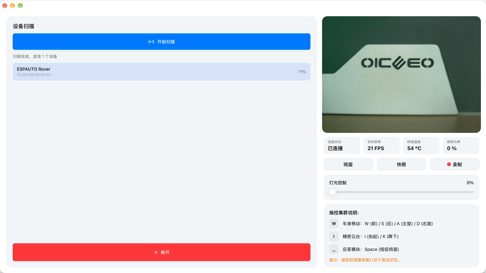

[English Version](README_EN.md) | **中文版**

# ESPAUTO

基于 ESP32 的 BLE 实时图传遥控小车项目

## 预览展示
| Android | Web PC |
| :---: | :---: |
|  |  |
| **Web Mobile** | **Arduino NESSO N1** |
|  |  |
| **Windows** | **Mac** | 
|  | 
## 简介
ESPAUTO 是一个基于低功耗蓝牙（BLE）的开源遥控小车项目。通过对 BLE 通信链路的优化，实现了实时的视频流传输与指令控制。项目包含 Android 端、Windows 端、Mac端、Arduino 端及 Web 端五种控制方式，适合作为学习 BLE 图像传输与 ESP32 开发的参考。

## 核心特性
- **通信协议：** 基于 ESP32-S3/C6 的 BLE 数据链路实现。
- **多端控制：**
  - **Android:** 支持 Android 12+，采用 Kotlin 原生开发。
  - **Windows:** 支持 Windows 10 19041+，采用 NET 8 原生开发。
  - **Mac:** 支持 MacOS 26+，采用 Swift 原生开发。
  - **Arduino:** 提供基于 Arduino Nesso N1 的物理遥控器固件。
  - **Web:** 支持浏览器控制，提供基本的 Web 遥控界面。
- **配置支持：** 内置中英文双语切换。
- **开源分享：** 固件与控制端源码完全公开，方便参考学习。

## 项目结构
- `/Android/ESPAUTO`: Android 客户端工程目录。
- `/Windows/ESPAUTO`: Windows 客户端工程目录。
- `/Mac/ESPAUTO`: Mac 客户端工程目录。
- `/Arduino`: ESP32 底层固件源码。
  - `/Car`: 小车端固件 (ESP32-S3 + OV5640)。
  - `/Remote`: 遥控器端固件 (Arduino Nesso N1 / ESP32-C6)。
- `/Web`: 网页控制端源码。

## 快速上手
### 1. 硬件准备
- **小车端:** ESP32-S3 + OV5640 摄像头模块。
- **遥控端:** Arduino Nesso N1 (搭载 ESP32-C6)。

### 2. 部署步骤
**固件烧录 (Arduino IDE):**
- **Car (ESP32-S3):** 使用 Arduino IDE 打开 `/Arduino/Car` 工程，配置好板型与端口，完成编译上传。
- **Remote (Arduino Nesso N1):** 使用 Arduino IDE 打开 `/Arduino/Remote` 工程，配置好板型与端口，完成编译上传。

**客户端运行:**
- **Android:** 使用 Android Studio 打开 `/Android/ESPAUTO` 工程，生成 apk 安装包。
- **Windows:** 使用 Visual Studio 打开 `/Windows/ESPAUTO` 工程，生成 msi 安装包。
- **Mac:** 使用 Xcode 打开 `/Mac/ESPAUTO` 工程，生成 app 安装包。
- **Web:**
  - **在线访问:** 点击 [访问 Web 在线客户端](https://honoz.github.io/ESPAUTO/Web/index.html) 即可直接连接使用。
  - **本地运行:** 在本地直接打开 `/Web/index.html` 即可使用。

**连接说明:**
- 设备间通过蓝牙建立配对连接即可使用。

## 开源协议
本项目采用 [MIT License](LICENSE) 开源。

## 反馈
欢迎提交 Issue 或 PR 参与项目交流。
