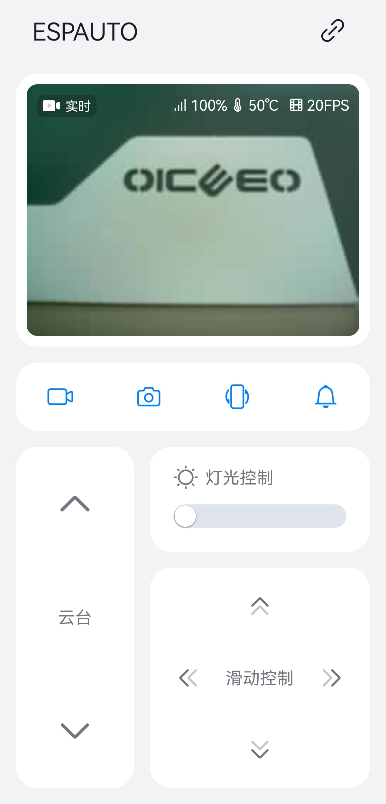
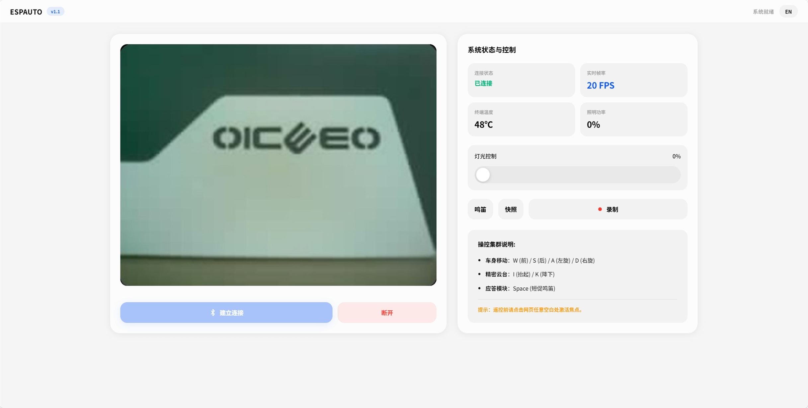
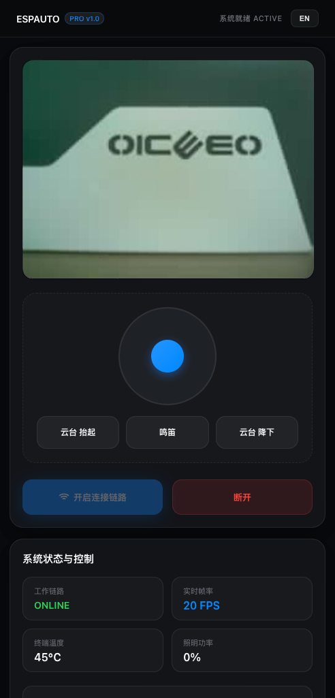
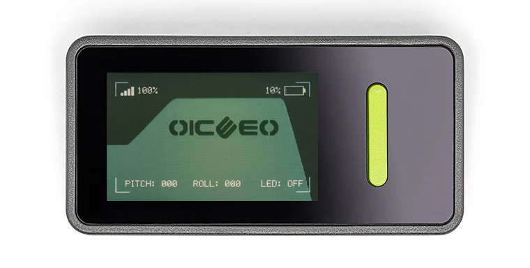
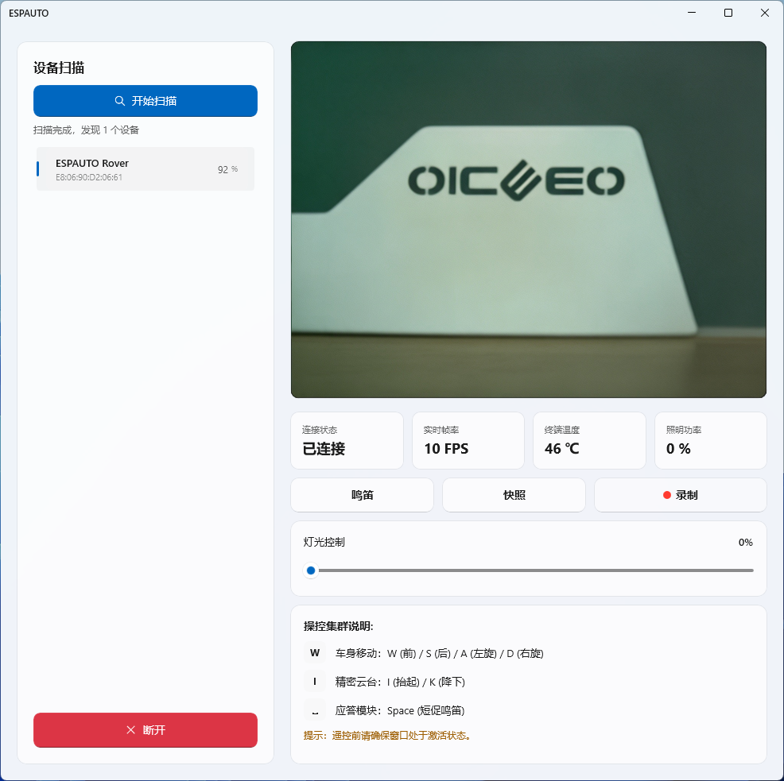

**English Version** | [中文版](README.md)

# ESPAUTO

An open-source RC car project featuring real-time video transmission via BLE (Bluetooth Low Energy) based on ESP32.

## Preview
| Android | Web PC |
| :---: | :---: |
|  |  |
| **Web Mobile** | **Arduino NESSO N1** |
|  |  |
| **Windows** |
|  |

## Introduction
ESPAUTO is an open-source RC car project built on Bluetooth Low Energy (BLE). By optimizing the BLE communication link, it achieves real-time video streaming and remote control. This project supports four control methods: Android, Windows, Arduino (Physical Remote), and Web, making it an ideal reference for learning BLE image transmission and ESP32 development.

## Key Features
- **Communication Protocol:** BLE data link optimized for ESP32-S3/C6 architectures.
- **Multi-Terminal Control:**
  - **Android:** Native development using Kotlin, supporting Android 12+.
  - **Windows:** Native development using WinUI 3 + .NET 8, supporting Windows 10 19041+.
  - **Arduino:** Dedicated physical remote firmware based on the Arduino Nesso N1.
  - **Web:** Responsive control interface, accessible via standard web browsers.
- **Internationalization:** Built-in support for both Chinese and English.
- **Open Source:** Fully transparent firmware and client source code for study and reference.

## Project Structure
- `/Android/ESPAUTO`: Android client source code.
- `/Windows/ESPAUTO`: Windows client source code.
- `/Arduino`: ESP32 firmware source code.
  - `/Car`: Firmware for the car (ESP32-S3 + OV5640).
  - `/Remote`: Firmware for the remote controller (Arduino Nesso N1 / ESP32-C6).
- `/Web`: Web control interface source code.

## Getting Started
### 1. Hardware Requirements
- **Car:** ESP32-S3 + OV5640 camera module.
- **Remote:** Arduino Nesso N1 (powered by ESP32-C6).

### 2. Deployment
**Firmware Flashing (Arduino IDE):**
- **Car (ESP32-S3):** Open the `/Arduino/Car` project in Arduino IDE, configure the board and port, then compile and upload.
- **Remote (Arduino Nesso N1):** Open the `/Arduino/Remote` project in Arduino IDE, configure the board and port, then compile and upload.

**Running Clients:**
- **Android:** Open the `/Android/ESPAUTO` project in Android Studio to compile and install.
- **Windows:** Use Visual Studio or `dotnet publish` to build the `/Windows/ESPAUTO` project and generate an MSI installer.
- **Web:**
  - **Online Access:** Click [Access Web Client](https://honoz.github.io/ESPAUTO/Web/index.html) to start using it directly.
  - **Local Run:** You can also open `/Web/index.html` directly in your browser.

**Connection:**
- Simply pair the devices via Bluetooth to start controlling.

## License
This project is licensed under the MIT License. See the [LICENSE](LICENSE) file for details.
